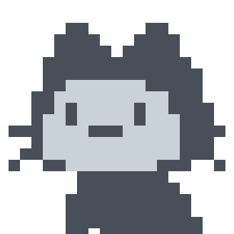

<h3 align="center">Bootstrap Coded Templates by TheNocturnalDevGypsy</h3>

<strong>You like the Repo? Don't forget to 🌟, 👁️, 🔱 and ❤️!</strong>

          

## 

First off, thank you for taking the time to contribute and support! The following is a set of guidelines to help you contribute and support to this project. These are mostly suggestions to maintain the project’s quality and ensure a smooth collaboration. Please note that this project is governed by a [Code of Conduct](CODE_OF_CONDUCT.md). By participating, you are expected to uphold this code.

There are several ways to contribute and support to this project, at least the basics are:

- Please do `Star`, `Watch` and `Fork` this repo? Or, maybe ❤️ by:

   

Aside that, you can also do by the following:
- Documentation Updates
- Feature Requests
- Bug Fixing

Contributors and supporters will be given credits and will be included to the List of Contributors and Supporters too! Thank you for helping make this project better!

## 

_None yet, be the first!_

<!--  -->

<!-- Make sure your request is meaningful and you have tested the app locally before submitting a pull request. -->

## 

Improving documentation is a valuable way to contribute! By contributing to the documentation, you’ll help improve the project’s accessibility and usability for all users! Here’s how you can help:

- **Check for duplicates** : Review the [open](https://github.com/thenocturnaldevgypsy/bootstrap-coded-templates/issues?q=is%3Aopen+is%3Aissue) and [closed](https://github.com/thenocturnaldevgypsy/bootstrap-coded-templates/issues?q=is%3Aissue+is%3Aclosed) issue tickets, as well as the 💡 [Ideas + Community Vote!](https://github.com/thenocturnaldevgypsy/bootstrap-coded-templates/discussions/categories/ideas-community-vote) and 💬 [Q & A](https://github.com/thenocturnaldevgypsy/bootstrap-coded-templates/discussions/categories/q-a) sections in the discussions tab, to ensure the suggestion or correction hasn’t already been submitted.
- **Submit your documentation changes** : You can propose your documentation updates in two ways:
  - Post in 💡 [Ideas + Community Vote!](https://github.com/thenocturnaldevgypsy/bootstrap-coded-templates/discussions/new?category=ideas-community-vote) : Share your ideas or corrections in the discussions tab to gather feedback and suggestions from others. OR,
  - Submit a [pull request (PR)](https://github.com/thenocturnaldevgypsy/bootstrap-coded-templates/compare) : Make the necessary changes directly to the code. Here's the requirements:
    - Prepare your workspace:
      - **[Fork the repository](https://github.com/thenocturnaldevgypsy/bootstrap-coded-templates/fork)** : Create a copy of the repo under your account.
      - **Clone the repo locally** : Work on the code on your local machine.
    - Create a new branch. Use the following naming convention for your branch:
      
      `docs-GitHubUserName-shortdescription`
      
      Examples:
      - `docs-thenocturnaldevgypsy-addedinstallationguidelines`
      - `docs-thenocturnaldevgypsy-updatedmdfilesformat`

    - Submit your pull request (PR):
      - Your PR should be linked to your branch
      - Add the `docs` label to your PR for backtracking purposes.
      - Add a detailed log of what changes were made in your PR. Do your best to fill out each field, preferably in as much detail as possible.
      - Assign the author ([Abegail Torrendon / thenocturnaldevgypsy](https://github.com/thenocturnaldevgypsy-io)) or maintainers to review your PR.
  
- **Review process** :
  - The author and maintainers will review all suggestions and make the necessary adjustments based on their judgment.
  - Unlike feature requests, documentation updates will not be subject to community voting. Decisions will rely solely on the maintainers’ perspective.
  - The original requestor will be credited by tagging them in both the issue and the related pull request. They will also be notified once the feature has been implemented and merged.

## 

We encourage suggestions for new features that can improve the project! Make sure your request is meaningful. Here’s how you can contribute:

- **Check for duplicates** : Before submitting a request, review the [open](https://github.com/thenocturnaldevgypsy/bootstrap-coded-templates/issues?q=is%3Aopen+is%3Aissue) and [closed](https://github.com/thenocturnaldevgypsy/bootstrap-coded-templates/issues?q=is%3Aissue+is%3Aclosed) issue tickets and the 💡 [Ideas + Community Vote!](https://github.com/thenocturnaldevgypsy/bootstrap-coded-templates/discussions/categories/ideas-community-vote) and 💬 [Q & A](https://github.com/thenocturnaldevgypsy/bootstrap-coded-templates/discussions/categories/q-a) sections in the discussions tab.
- **Submit your idea** : If your idea hasn’t been proposed, post it in the 💡 [Ideas + Community Vote!](https://github.com/thenocturnaldevgypsy/bootstrap-coded-templates/discussions/new?category=ideas-community-vote) discussion section.
  - Provide a clear and concise explanation, including:
    - Why the feature is needed: Explain the problem it solves or the value it adds for users.
    - Visual aids (optional) : Share mockups, flowcharts, or any other material to help visualize your idea.
  - **Community prioritization** : Features will be prioritized based on community feedback. Ideas with at least 10 "Yes/I support" votes will be considered for implementation.
- Once the idea has gained enough support, the author or maintainers will create a corresponding issue ticket, add the label `feat`, and linking it back to the original discussion post to begin the implementation process.
- The original requestor will be credited by tagging them in both the issue and the related pull request. They will also be notified once the feature has been implemented and merged.

## 

If you find a bug or issue in the project, please follow these steps:
- **Check for duplicates** : Review the [open](https://github.com/thenocturnaldevgypsy/bootstrap-coded-templates/issues?q=is%3Aopen+is%3Aissue) and [closed](https://github.com/thenocturnaldevgypsy/bootstrap-coded-templates/issues?q=is%3Aissue+is%3Aclosed) issue tickets, as well as the 💡 [Ideas + Community Vote!](https://github.com/thenocturnaldevgypsy/bootstrap-coded-templates/discussions/categories/ideas-community-vote) and 💬 [Q & A](https://github.com/thenocturnaldevgypsy/bootstrap-coded-templates/discussions/categories/q-a) sections in the discussions tab, to ensure the bug hasn't already been reported.
- **Submit an issue ticket** : If the bug hasn't been reported, create a [new issue](https://github.com/thenocturnaldevgypsy/bootstrap-coded-templates/issues/new) ticket with the label `bug` and include the following details to help us understand and resolve the issue:
  - **Steps to reproduce** : Provide clear and detailed steps to replicate the problem.
  - **Environment details** : Mention your OS, browser, or any other relevant environment specifics.
  - **Screenshots or code snippets** : Attach any visual aids or code snippets if applicable.
  - **Test case reference (if available)** : Share a link to a relevant test case that demonstrates the bug.
  - **Indicate if you’re willing to contribute to fixing the bug.**
  - Tag or assign the author ([Abegail Torrendon / thenocturnaldevgypsy](https://github.com/thenocturnaldevgypsy-io)) or maintainers to review.
- For those who wanted to fix the bug by themselves, please do the following:
  - Wait for the author or maintainers to review the bug ticket, have it cleared and assign it to you. Once it's been assigned to you, you can now submit a [pull request (PR)](https://github.com/thenocturnaldevgypsy/bootstrap-coded-templates/compare) to make the necessary changes directly to the code.
    - Prepare your workspace:
      - **[Fork the repository](https://github.com/thenocturnaldevgypsy/bootstrap-coded-templates/fork)** : Create a copy of the repo under your account.
      - **Clone the repo locally** : Work on the code on your local machine.
    - Create a new branch. Use the following naming convention for your branch:
      
      `fix-GitHubUserName-iXX-shortdescription` , where:
      - `GitHubUserName` - your GitHub username
      - `iXX` - i for ISSUE,  XX is your issue ticket number
      
      Examples:
      - `fix-thenocturnaldevgypsy-i21-updatedisotopejs`
      - `fix-thenocturnaldevgypsy-i37-fixscrollingbug`

    - Submit your pull request (PR):
      - Your PR should be linked to your branch
      - Add the `bug` and `fix` label to your PR for backtracking purposes.
      - Add a detailed log of what changes were made in your PR. Do your best to fill out each field, preferably in as much detail as possible.
      - Follow the coding style already present in the repository. Document functions and methods where necessary.
      - Make sure you have tested the app locally before submitting a pull request. If you can add test cases and references, it would be nice.
    - Assign the author ([Abegail Torrendon / thenocturnaldevgypsy](https://github.com/thenocturnaldevgypsy-io)) or maintainers to review your PR.
- The reporter and fixer will be credited by tagging them both the issue and the related pull request. They will also be notified once the feature has been implemented and merged.

## 

If you have any questions, you can contact the maintainers in this project's [discussions](https://github.com/thenocturnaldevgypsy/bootstrap-coded-templates/discussions) section.

- 📣 [Announcements & Updates](https://github.com/thenocturnaldevgypsy/bootstrap-coded-templates/discussions/categories/announcements-updates) : Announcements, updates and roadmaps from maintainers.
- 💡 [Ideas + Community Vote!](https://github.com/thenocturnaldevgypsy/bootstrap-coded-templates/discussions/categories/ideas-community-vote) : Share ideas for new features and let the community vote for it!
- 🎉 [IN ACTION! Show and Tell!](https://github.com/thenocturnaldevgypsy/bootstrap-coded-templates/discussions/categories/in-action-show-and-tell) : If you have a particularly cool way of using this project/repo, show it off by sharing it here!
- 💬 [Q & A](https://github.com/thenocturnaldevgypsy/REPONAME/bootstrap-coded-templates/categories/q-a) :  Ask the maintainers about... anything you want. Ask questions. Receive answers.

Also, feel free to contact me (author) by [creating a new discussion](https://github.com/thenocturnaldevgypsy/thenocturnaldevgypsy/discussions/new?category=ask-me-anything-ama-and-q-a) at **💬 Ask Me Anything! (AMA and Q&A)** category under my GitHub Profile Repo's Discussions.