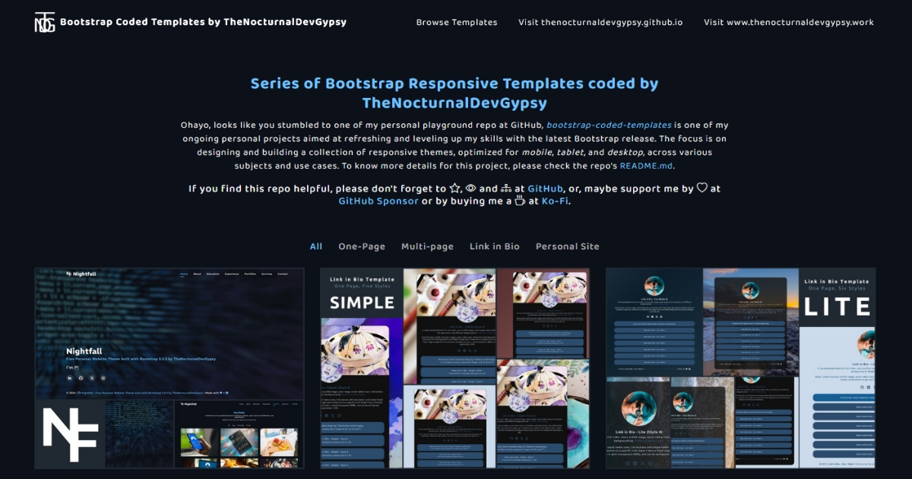

<p align="center"></p>
<h3 align="center">Bootstrap Coded Templates by TheNocturnalDevGypsy</h3>
<p align="center"><strong>You like the Repo? Don't forget to 🌟, 👁️, 🔱 and ❤️!</strong></p>
<p align="center">
         <a href="https://ko-fi.com/thenocturnaldevgypsy"></a> <a href="https://github.com/sponsors/thenocturnaldevgypsy"></a>
</p>

## 

`bootstrap-coded-templates` is one of my ongoing personal projects aimed at refreshing and leveling up my skills with the latest Bootstrap release. The focus is on designing and building a collection of responsive themes, optimized for `mobile`, `tablet`, and `desktop`, across various subjects and use cases.


- Via GitHub Pages: https://
- Via Vercel : https://


<a href="https://github.com/thenocturnaldevgypsy"></a>

## 
| Template | Pages | # of Styles | Version | Description |
| ------------- | ------------- | ------------- | ------------- | ------------- |
| [Personal Site - Nightfall](template-personalsite-nightfall.md) | Multi-page | 1 | 2.1.0 | A multi-page personal website. Has the basic pages needed: Home, About, Education, Experience, Portfolio, Services, Contact Details (no contact form yet) |
| [Link in Bio - Simple](template-linkinbio-simple.md) | One Page | 6 | 2.2.0 | A simple template/theme for Link in Bio. Comes with a profile image, cover/banner, social medial icons, link buttons with descriptions, and different backgrounds |
| [Link in Bio - Lite](template-linkinbio-lite.md) | One Page | 6 | 2.2.0 | A lite template/theme for Link in Bio. Just a profile image, social medial icons, link buttons, and different backgrounds |

## 

**IDE and OS**
```
Visual Studio Code
Version: 1.99.0 (user setup)
Commit: 4437686ffebaf200fa4a6e6e67f735f3edf24ada
Date: 2025-04-02T21:35:19.530Z
Electron: 34.3.2
ElectronBuildId: 11161073
Chromium: 132.0.6834.210
Node.js: 20.18.3
V8: 13.2.152.41-electron.0
OS: Windows_NT x64 10.0.19045
```
**Docker and Nginx Details**
- [Docker .env](.env)
- [docker-compose.yml](docker-compose.yml)
- [Nginx Config](nginx\default.conf)

**Frameworks, Libraries and Tools (most in all templates)**
- Bootstrap 5.3.3 https://github.com/twbs/bootstrap
- Bootstrap Icons https://github.com/twbs/icons
- FontAwesome 6 Icons (Free) https://github.com/FortAwesome/Font-Awesome
- Lineicons 5 Basic (Free) https://github.com/LineiconsHQ/Lineicons
- Google Font: Ubuntu https://fonts.google.com/specimen/Ubuntu
- AOS (Animate on scroll) https://github.com/michalsnik/aos
- imagesLoaded https://github.com/desandro/imagesloaded
- Isotope https://github.com/metafizzy/isotope
- purecounterjs https://github.com/srexi/purecounterjs
- Swiper.js https://github.com/nolimits4web/swiper
- Typed.js https://github.com/mattboldt/typed.js
- Waypoint.js (No Framework) https://github.com/imakewebthings/waypoints
- Nginx 1.27.4 (Docker Image Tag: `nginx:latest`)

## 

At the moment, the repository contains the following files and directory structure, where:
```
project-root/
├─ .github/                                   # for FUNDING.yml and future GH workflows (if needed)
├─ md_assets/                                 # assets folder for markdown files (repo documentation)
├─ nginx/                                     # Nginx configuration directory
│    └─ default.conf                          # Nginx configurations (DEV Env)
├─ docs/                                      # App's source code
│    ├─ assets/                               # assets folder for images, css, js and libraries for index.html
│    │    ├─ css/                             # main directory for storing css file for index.html
│    │    ├─ images/                          # main directory for storing image files for index.html
│    │    │   ├─ favicons/                    # favicons for the website for index.html
│    │    │   └─ portfolio/                   # portfolio mockup images for index.html
│    │    ├─ js/                              # main directory for storing js files for index.html
│    │    └─ library/                         # main directory for the framework and libraries used for index.html
│    ├─ template-linkinbio-lite/              # bootstrap theme, also contain their own assets folder
│    ├─ template-linkinbio-simple/            # bootstrap theme, also contain their own assets folder
│    ├─ template-personalsite-nightfall/      # bootstrap theme, also contain their own assets folder
│    └─ index.html                            # inventory/catalog page of the bootstrap templates available
├─ .env                                       # .env for docker-compose.yml (DEV Env)
├─ .gitignore                                 # files ignored by Git
├─ bootstrap-coded-templates.code-workspace   # VS Code workspace config
├─ CHANGELOG.md                               # project changelog documentation
├─ CONTRIBUTING.md                            # contribution protocol documentation
├─ docker-compose.yml                         # Docker setup for this project (DEV Env)
├─ LICENSE                                    # license file
└─ README.md                                  # project documentation
```
Templates are stored separately in their dedicated directories (e.g. `template-linkinbio-lite` , `template-personalsite-detailed`) and it has the following files and directory arrangement. For example:
```
├─ docs/ 
│    └─ template-linkinbio-lite/
│          ├─ assets/                        # assets folder for images, css, js and libraries
│          │    ├─ css/                      # main directory for storing css file
│          │    ├─ images/                   # main directory for storing image files
│          │    │   └─ favicons/             # favicons for the website
│          │    ├─ js/                       # main directory for storing js files
│          │    └─ library/                  # main directory for the framework and libraries used
│          ├─ template-linkinbio-lite.zip    # zip file of the template
│          └─ index.html                     # homepage / index of the template/theme
```

## 
See the [open issues](https://github.com/thenocturnaldevgypsy/bootstrap-coded-templates/issues) and [backlog](https://github.com/thenocturnaldevgypsy/bootstrap-coded-templates/milestones) for the list of proposed features (and known issues).

## 

Below is the latest updates, go to the [Changelog Listing](CHANGELOG.md) for the complete information.

| Version | Date | Commit/Issue/PR | Type | Description |
| ------------- | ------------- | ------------- | ------------- | ------------- |
| 3.0.0 | 18.04.2025 | [I#9](https://github.com/thenocturnaldevgypsy/bootstrap-coded-templates/issues/9), [PR#](https://github.com/thenocturnaldevgypsy/bootstrap-coded-templates/pull/) | refactor, build, docs | - Renamed the repo to `bootstrap-coded-templates`, as the goal is to revamp this repo for storing all the Bootstrap templates I've coded moving forward<br>- Added Docker and Nginx setup/config (Dev Env)<br>- Merged all Bootstrap templates (https://github.com/thenocturnaldevgypsy/nightfall-bootstrap-template-personal , https://github.com/thenocturnaldevgypsy/gypsyshards-bootstrap-template-linkinbio) I've made into this repo, changed the directory setup for easy management<br>- Added zip files for each templates for easy downloading<br>- Updated Labels and enabled discussions in this repo<br>- Updated documentation and contribution guidelines<br>- Deployed at Vercel and GitHub Pages |

## 
Contributions and supporters are welcome! Please refer to [CONTRIBUTING.md](CONTRIBUTING.md) for more details on how to contribute to the project.


_None yet, be the first!_

<!-- <a href="https://github.com/thenocturnaldevgypsy"></a> -->

## 

If you'd like to use this repo for your own project, I would like to ask a favor from you:
- Please do `Star` and `Watch` this repo? Or, maybe ❤️ by:
  
  <a href="https://ko-fi.com/thenocturnaldevgypsy"></a> <a href="https://github.com/sponsors/thenocturnaldevgypsy"></a>
- Click `Fork` at the top of this page.
- Please be mindful of the [LICENSE](LICENSE.md) applicable

## 
Distributed under the MIT License by [Abegail Torrendon / thenocturnaldevgypsy](https://github.com/thenocturnaldevgypsy).
- You can freely modify and reuse.
- The original [LICENSE](LICENSE.md) must be included with copies of this software/template.
- Please link back (if you can fork, the better) to this repo. 

## 
I'd love to hear your thoughts on the project and get your suggestions. Feel free to [create new issue](https://github.com/thenocturnaldevgypsy/gypsyshards-bootstrap-template-linkinbio/issues/new) on this repo or you can also contact me by [creating a new discussion](https://github.com/thenocturnaldevgypsy/thenocturnaldevgypsy/discussions/new?category=ask-me-anything-ama-and-q-a) at **💬 Ask Me Anything! (AMA and Q&A)** category under my GitHub Profile Repo's Discussions.

We would love to hear your thoughts on this project and get your suggestions and feedbacks (especially if you used it!). You can contact the maintainers in this project's [discussions](https://github.com/thenocturnaldevgypsy/bootstrap-coded-templates/discussions) section.

- 📣 [Announcements & Updates](https://github.com/thenocturnaldevgypsy/bootstrap-coded-templates/discussions/categories/announcements-updates) : Announcements, updates and roadmaps from maintainers.
- 💡 [Ideas + Community Vote!](https://github.com/thenocturnaldevgypsy/bootstrap-coded-templates/discussions/categories/ideas-community-vote) : Share ideas for new features and let the community vote for it!
- 🎉 [IN ACTION! Show and Tell!](https://github.com/thenocturnaldevgypsy/bootstrap-coded-templates/discussions/categories/in-action-show-and-tell) : If you have a particularly cool way of using this project/repo, show it off by sharing it here!
- 💬 [Q & A](https://github.com/thenocturnaldevgypsy/REPONAME/bootstrap-coded-templates/categories/q-a) :  Ask the maintainers about... anything you want. Ask questions. Receive answers.

Also, feel free to contact me (author) by [creating a new discussion](https://github.com/thenocturnaldevgypsy/thenocturnaldevgypsy/discussions/new?category=ask-me-anything-ama-and-q-a) at **💬 Ask Me Anything! (AMA and Q&A)** category under my GitHub Profile Repo's Discussions.