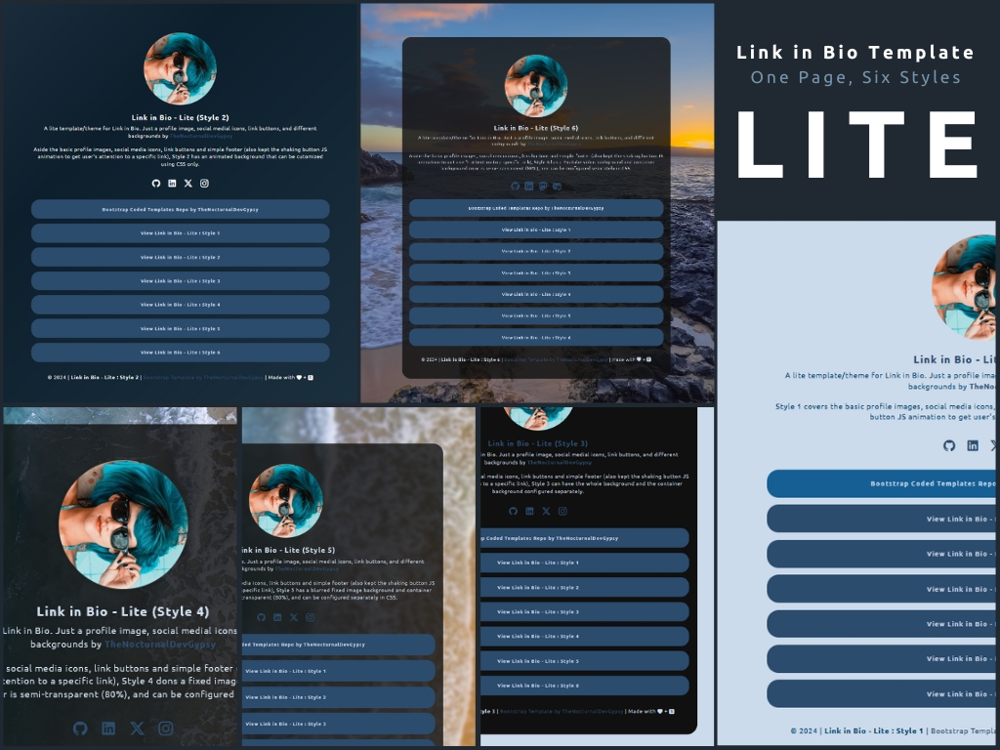

<h3 align="center">Bootstrap Coded Templates by TheNocturnalDevGypsy</h3>
<p align="center"><strong>You like the Repo? Don't forget to 🌟, 👁️, 🔱 and ❤️!</strong></p>
<p align="center">
         <a href="https://ko-fi.com/thenocturnaldevgypsy"></a> <a href="https://github.com/sponsors/thenocturnaldevgypsy"></a>
</p>

## 


<br><br>

 

`Link in Bio - Lite` is a simple Link in Bio template made with Bootstrap and distributed under the MIT License by by [Abegail Torrendon / thenocturnaldevgypsy](https://github.com/thenocturnaldevgypsy), this means:

- You can freely modify and reuse.
- The original [LICENSE](LICENSE) must be included with copies of this template.
- Please link back (if you can fork, the better) to this repo. 

This template has the following features:
- Responsive for `mobile`, `tablet`, and `desktop` browser view
- Has profile image, social medial icons, link buttons
- One of the lnik buttons shakes every 6 seconds (can be removed/optional)
- Styled with different backgrounds
  - Solid background (overall) color
  - Color fading/transitioning background
  - Solid background color and solid container background color
  - Image background and semi-transparent solid container background color
  - Semi-transparent image background and semi-transparent solid container background color
  - Youtube viode background and semi-transparent solid container background color


- Via GitHub Pages: https://thenocturnaldevgypsy.github.io/bootstrap-coded-templates/template-linkinbio-lite/
- Via Vercel : https://tndg-bsct-linkinbio-lite.vercel.app/
- Download ZIP: [template-linkinbio-lite.zip](/docs/template-linkinbio-lite/template-linkinbio-lite.zip)

## 

```
project-root/
├─ docs/ 
│    └─ template-linkinbio-lite/
│         ├─ assets/                            # assets folder for images, css, js and libraries
│         │    ├─ css/                          # main directory for storing css file
│         │    │   ├─ style-lite-001.css        # CSS file for style 1 of link in bio - lite
│         │    │   ├─ style-lite-002.css        # CSS file for style 2 of link in bio - lite
│         │    │   ├─ style-lite-003.css        # CSS file for style 3 of link in bio - lite
│         │    │   ├─ style-lite-004.css        # CSS file for style 4 of link in bio - lite
│         │    │   ├─ style-lite-005.css        # CSS file for style 5 of link in bio - lite
│         │    │   └─ style-lite-006.css        # CSS file for style 6 of link in bio - lite
│         │    ├─ images/                       # main directory for storing image files
│         │    │   ├─ favicons/                 # favicons for the website
│         │    │   ├─ background-image.jpg      # background image used
│         │    │   └─ profile-image.jpg         # profile image used
│         │    ├─ js/                           # main directory for storing js files
│         │    │   ├─ core-lite-001.js          # JS file for style 1 of link in bio - lite
│         │    │   ├─ core-lite-002.js          # JS file for style 2 of link in bio - lite
│         │    │   ├─ core-lite-003.js          # JS file for style 3 of link in bio - lite
│         │    │   ├─ core-lite-004.js          # JS file for style 4 of link in bio - lite
│         │    │   ├─ core-lite-005.js          # JS file for style 5 of link in bio - lite
│         │    │   └─ core-lite-006.js          # JS file for style 6 of link in bio - lite
│         │    └─ library/                      # main directory for the framework and libraries used
│         │        ├─ bootstrap-5.3.3-dist/
│         │        ├─ bootstrap-icons-1.11.3/
│         │        └─ lineicons-5-basic-free/
│         ├─ template-linkinbio-lite.zip         # zip file of the template
│         ├─ index.html                          # style 1 of link in bio - lite
│         ├─ lite-002.html                       # style 2 of link in bio - lite
│         ├─ lite-003.html                       # style 3 of link in bio - lite
│         ├─ lite-004.html                       # style 4 of link in bio - lite
│         ├─ lite-005.html                       # style 5 of link in bio - lite
│         └─ lite-006.html                       # style 6 of link in bio - lite
```

## 

- Bootstrap 5.3.3 https://github.com/twbs/bootstrap
- Bootstrap Icons https://github.com/twbs/icons
- Lineicons 5 Basic (Free) https://github.com/LineiconsHQ/Lineicons
- Google Font: Ubuntu https://fonts.google.com/specimen/Ubuntu

Image and Video Sources Credits
- [Sunglasses, Woman, Pool image. Free for use - Asset by danielsampaioneto](https://pixabay.com/photos/sunglasses-woman-pool-girl-lying-2705642/) : `assets/images/profile-image.jpg`
- [Beach, Coast, Sea image. Free for use - Asset by StockSnap](https://pixabay.com/photos/beach-coast-sea-sand-wave-ocean-2562563/) : `assets/images/background-image.jpg` 
- [ 8 HOURS of Fascinating Sunset over the Tropical Beach with Calming Waves Sounds (4K UHD) : Asset by Nature Souncscapes at Youtube](https://www.youtube.com/watch?v=0ANLBX2EgmM) : `https://www.youtube.com/watch?v=0ANLBX2EgmM`

## 

See the [open issues](https://github.com/thenocturnaldevgypsy/bootstrap-coded-templates/issues) and [backlog](https://github.com/thenocturnaldevgypsy/bootstrap-coded-templates/milestones) for the list of proposed features (and known issues).

## 

Chronological list of updates and changes to the template.

| Version | Date | Commit/Issue/PR | Type | Description |
| ------------- | ------------- | ------------- | ------------- | ------------- |
| 2.2.0 | 19.04.2025 | [I#9](https://github.com/thenocturnaldevgypsy/bootstrap-coded-templates/issues/9), [PR#14](https://github.com/thenocturnaldevgypsy/bootstrap-coded-templates/pull/14), [PR#15](https://github.com/thenocturnaldevgypsy/bootstrap-coded-templates/pull/15) [PR#]() | refactor, build, docs | - Renamed the repo from `gypsyshards-bootstrap-template-linkinbio` to `bootstrap-coded-templates`, renamed `Theme 1` to `Link in Bio - Lite`, and moved the source code to `\source code\template-linkinbio-lite` directory under https://github.com/thenocturnaldevgypsy/bootstrap-coded-templates/<br>- Created `template-linkinbio-lite.md` to serve as the template's documentation, updated some of the links with the new repo name<br>- Created `\source code\template-linkinbio-lite.html` to record the template to the main template catalog<br>- Added ZIP file for easy template download<br>- Redeployed at Vercel: https://tndg-bsct-linkinbio-lite.vercel.app/ |
| 2.1.5 | 12.03.2025 | [I#7](https://github.com/thenocturnaldevgypsy/bootstrap-coded-templates/issues/7), [PR#8](https://github.com/thenocturnaldevgypsy/bootstrap-coded-templates/pull/8) | chore, docs. refactor | - Updated the labels and milestones in this repo, reassigned labels to previous and current issues and PRs<br>- Updated MD files dead/404 URLs |
| 2.1.4 | 27.02.2025 | [I#5](https://github.com/thenocturnaldevgypsy/bootstrap-coded-templates/issues/5), [PR#6](https://github.com/thenocturnaldevgypsy/bootstrap-coded-templates/pull/6) | refactor | Transferred repo back to my main GitHub account<br>- Updated FUNDING.yml<br>- Redeployed at Vercel, Live URL: https://gypsyshards.vercel.app/ |
| 2.1.3 | 20.10.2024 | [I#1](https://github.com/thenocturnaldevgypsy/bootstrap-coded-templates/issues/1), [PR#2](https://github.com/thenocturnaldevgypsy/bootstrap-coded-templates/pull/2), [I#3](https://github.com/thenocturnaldevgypsy/bootstrap-coded-templates/issues/3), [PR#4](https://github.com/thenocturnaldevgypsy/bootstrap-coded-templates/pull/4) | build, deploy, docs, refactor | - Old GitHub account [@thenocturnaldevgypsy](https://github.com/thenocturnaldevgypsy) got flagged for no reason given, recreating the repo to the new account [@thenocturnaldevgypsy-io](https://github.com/thenocturnaldevgypsy-io)<br>- Updated the repo's documentation's URL for some links, but kept the ones from the CHANGELOG<br>- Redeployed at Vercel, Live URL: https://gypsyshards.vercel.app/<br>- For more info for the whole migration, [[tndg] > [tndg-io] Migrate @thenocturnaldevgypsy to @thenocturnaldevgypsy-io](https://github.com/users/thenocturnaldevgypsy/projects/11) |
| 2.1.2 | 12.10.2024 | -- | docs | Updated the documentation format using https://github.com/thenocturnaldevgypsy/tndg-mine-mdtemplatearchive |
| 2.1.1 | 15.09.2024 | -- | fix, docs | - Updated one of the Link Buttons to shake for few seconds, stops, and shakes again.<br>- Updated documentation for the changes, reviewed coding and filename structuring. |
| 2.0.1 | 14-15.09.2024 | -- | feat | - Updated Markdown files structure overall based on the template: https://github.com/thenocturnaldevgypsy/tndg-mine-mdtemplatearchive, create separate pages for each themes, changelogs and `CONTRIBUTING.md` to make it easier to update.<br>- Fix the files and directory structure, and file naming of the whole repo. |
| 1.1.3 | 06-07.09.2024 | -- | feat | - Revisited the CSS reponsive compatibilities for `mobile`, `tablet` and `desktop` for the current templates<br>- Finished `theme-001-04.html`, `theme-001-05.html`, `theme-001-06.html`, `theme-001-07.html`, `theme-001-08.html`, `theme-001-09.html`, `theme-001-10.html` and `theme-001-11.html`<br>- Established the GitHub Pages of the repo: https://thenocturnaldevgypsy.github.io/gypsyshards-bootstrap-template-linkinbio/ |
| 1.1.2 | 01.09.2024 | -- | feat | Finished `theme-001-02.html` and `theme-001-03.html` |
| 1.1.1 | 29-31.08.2024 | -- | Initial | Started the project, decided which tools to be used, setup the repo to public, finished the initial directory design, `README.md`, `LICENSE`, `FUNDING.yml`, `index.html` and `theme-001-01.html` |